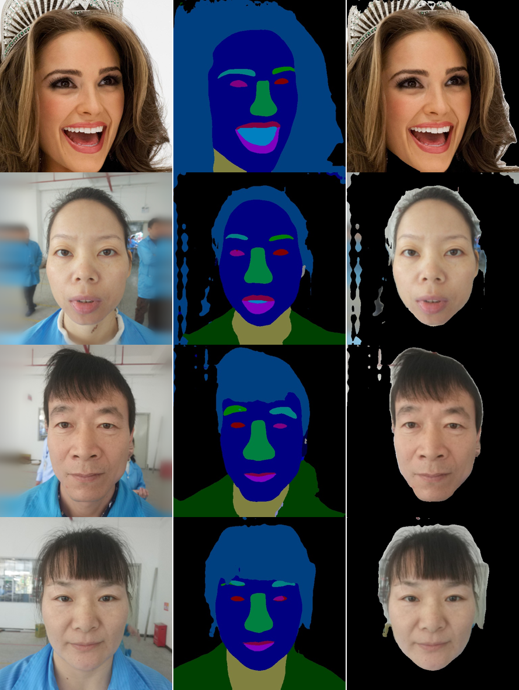

## Face_Parsing_DeepLabV3+

Tensorflow Implementation of Face Parsing using DeeplabV3+ in which  Resnet101 is used as the encoder.

### Installation requirements

We use GPU and CPU respectively for face parsing, both of which can work normally. And all the dependence has been package to **requirements.txt**. and you can use it to recreate the environment

```shell
pip install -r requirements.txt 
```

### Inference

```python
SRC=''
DST=''
SELECT_PARTIAL=['skin', 'left_brow']
```

There are **three Parameters** you need to modified, **SRC**: the source path of original image which has been preprocessed by face detection and face crop ; **DST**: the destination dir of result image to save; **SELECT_PARTIAL**: which attribute you need to retain  in the result image (and the pixel of other area will be set as **BLACK**)

Besides, there is a additional parameter **mask_save=False** in function inference , if it set as True, the DST dir will also save another image is the mask result of face parsing. 

Before inference, we assume that you have downloaded all the model files and placed them in the correct location, including **resnet_v2_101.ckpt** in "./resnet_v2_101" and **"deeplabv3plus.model"** in 'deeplabv3/checkpoints'

```shell
python inference.py
```

### Train

In order to migrate the deeplabV3+ network in other tasks, we rebuilded the train script in tensorflow, and you also can retrain the face parsing.

All the hyperparameters can be find in **train.py**, and these are simple, just adjust according to your actual situation. The only one you need to pay attention is that, CelebA-HQ dataset was used  in our model train, but original data is not suitable for this train version, so we rebuild the data and place it in **CelebAMask-Manual** ,the detail of data rebuild can be find in repository of **BiseNet**, and the rebuild data will be release in BAIDU netdisk soon.

if all the hyperparameters and data is correct, just run:

```shell
python train.py
```

the mIoU of train dataset is about **0.741805**.

### Results

The results in "face" and "hair".



### Note

The result of face segmentation is not as perfect as imagined, the reason why  is that the data we used to is celebahq which has a high resolution, but the data we used to inference are the actual images,  The distribution between the two is very different. We believe that adding more training data or using actual data for training will improve this problem.